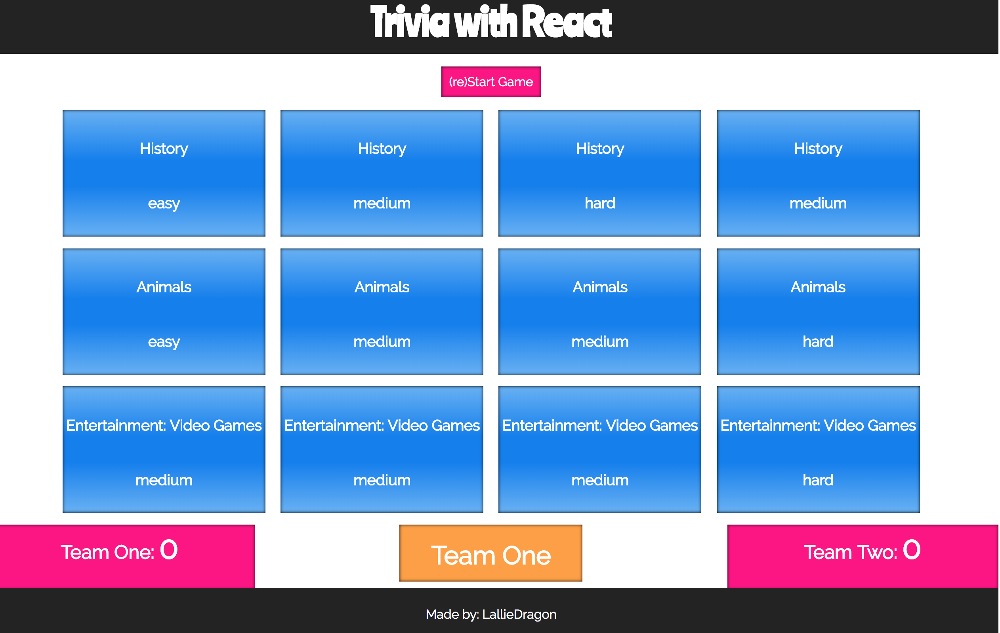
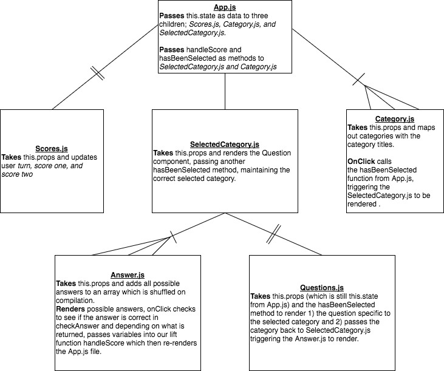
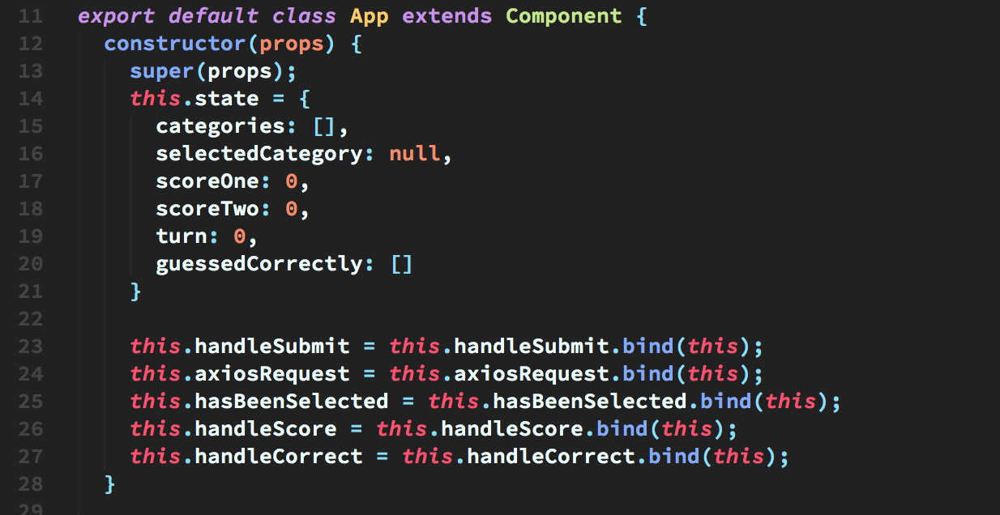
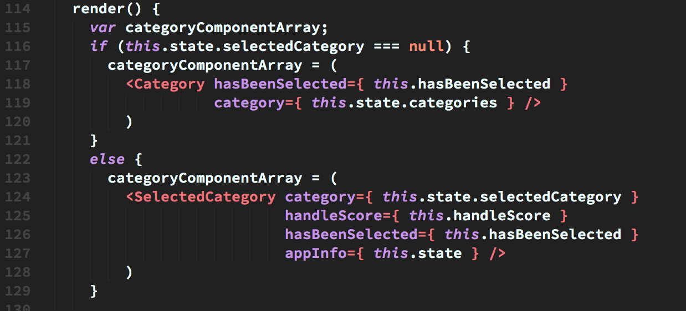

## Table of Contents

- [Getting Started](#)
- [The Concept](#the-concept)
- [Operating the Game](#operating-the-game)
- [The Code](#the-code)
- [Future Versions](#future-versions)

## Getting Started

- Type ```git clone https://github.com/LallieDragon/trivia-with-react.git``` 
into your CLI to install the game. 
- ```cd react-trivia```
- ```npm install``` to install dependencies.
- ```npm start``` to run in localhost:3000.

or visit [the app](https://two-team-trivia.herokuapp.com/) on Heroku!

## The Concept



This is the final project for the Web Development Immersive course
put on by General Assembly - Austin. The goal was to create a web
application in a few days using any programming language that we had 
learned, inside or outside of the course.

I decided to create a Trivia application using React.js and 
render data from children through lift functions instead of Redux.
It makes three separate Ajax calls and stores the data in an
array of categories. The data returned from the call is made up of
three question categories; General Knowledge, Entertainment: Films,
Entertainment: Video Games.



## Operating the Game

Welcome to React Trivia! 

Press the re(Start) button to get started!

Rules:
- The players are made up of two teams. Team one will always begin.
- The active team picks a category and attempts to answer the question. 
- If answered correctly, 100 points will be added to the active team's score.
- The current team will not change until a question is answered incorrectly.
- The game is over when one team has reached 700 points.

## The Code

My initial attempt at coding this application did not take much advantage of
React's super flexible components nor did I initially plan to have lift functions
to update this.state of my App.js file. On the second take I took advantage of the 
chance to rewire my wireframes, exhibiting the need for passing the lift functions
as well as where they needed to be passed to. 



I would say that my main obstacle in this web application was simply utilizing those 
lift functions and rendering different things based on what they did to this.state. 
Eventually I was able to get the architecture of the code just right so that when you
click on the category you wish to guess from it would then exhibit the question. 



## Future Versions

When I continue working on Trivia With React, I will add a component that will record 
the number of games won by each team. Ideally the user(s) will also be able to decide what categories of questions they want pulled from the API.
